# Startup Connect ER Diagram

This document contains the Entity-Relationship diagram for the Startup Connect application. The diagram is written in Mermaid format and can be rendered using any Mermaid-compatible viewer.

## Relationships Overview

1. **User Relationships**
   - A User can have one StartupProfile (for startup users)
   - A User can have one InvestorProfile (for investor users)
   - A User can send many Messages
   - A User can receive many Messages
   - A User can have many Notifications

2. **StartupProfile Relationships**
   - A StartupProfile belongs to one User
   - A StartupProfile can have many PitchDecks
   - A StartupProfile can have many Transactions (as recipient)
   - A StartupProfile can receive many InvestmentOffers

3. **InvestorProfile Relationships**
   - An InvestorProfile belongs to one User
   - An InvestorProfile can make many Transactions
   - An InvestorProfile can make many InvestmentOffers

## Key Features

- The system supports both Startup and Investor user types through profiles
- Investment process is tracked through Transactions and InvestmentOffers
- Communication is facilitated through Messages
- Users are notified of important events through Notifications
- Startups can manage their pitch decks
- Detailed tracking of investment negotiations and transactions

## Notes

- All timestamps are stored as DateTime
- Files (like pitch decks) are stored with metadata and content
- The system supports negotiation workflow through Transaction entity
- Investment offers can have different statuses (ACTIVE, CLOSED, EXPIRED, NEGOTIATING)

```mermaid
flowchart TB
    %% External Entities
    Startup((Startup))
    Investor((Investor))
    Admin((Admin))
    System((System))

    %% Processes
    Auth[Authentication]
    ProfileMgmt[Profile Management]
    InvestmentProcess[Investment Process]
    Communication[Communication]
    NotificationSystem[Notification System]
    FileManagement[File Management]

    %% Data Stores
    UserDB[(User Database)]
    ProfileDB[(Profile Database)]
    TransactionDB[(Transaction Database)]
    MessageDB[(Message Database)]
    NotificationDB[(Notification Database)]
    FileDB[(File Database)]

    %% Startup Flows
    Startup -->|Register/Login| Auth
    Startup -->|Update Profile| ProfileMgmt
    Startup -->|Upload Pitch Deck| FileManagement
    Startup -->|Send Message| Communication
    Startup -->|View Offers| InvestmentProcess
    Startup -->|Negotiate| InvestmentProcess

    %% Investor Flows
    Investor -->|Register/Login| Auth
    Investor -->|Update Profile| ProfileMgmt
    Investor -->|Browse Startups| ProfileMgmt
    Investor -->|Make Offer| InvestmentProcess
    Investor -->|Send Message| Communication
    Investor -->|View Transactions| InvestmentProcess

    %% Admin Flows
    Admin -->|Manage Users| Auth
    Admin -->|Monitor Transactions| InvestmentProcess
    Admin -->|System Settings| System

    %% Authentication Flows
    Auth -->|Store User Data| UserDB
    Auth -->|Validate Credentials| UserDB

    %% Profile Management Flows
    ProfileMgmt -->|Store Profile Data| ProfileDB
    ProfileMgmt -->|Retrieve Profiles| ProfileDB

    %% Investment Process Flows
    InvestmentProcess -->|Store Transactions| TransactionDB
    InvestmentProcess -->|Update Status| TransactionDB
    InvestmentProcess -->|Generate Notifications| NotificationSystem

    %% Communication Flows
    Communication -->|Store Messages| MessageDB
    Communication -->|Retrieve Messages| MessageDB
    Communication -->|Generate Notifications| NotificationSystem

    %% File Management Flows
    FileManagement -->|Store Files| FileDB
    FileManagement -->|Retrieve Files| FileDB

    %% Notification System Flows
    NotificationSystem -->|Store Notifications| NotificationDB
    NotificationSystem -->|Send Alerts| System

    %% System Flows
    System -->|System Events| NotificationSystem
    System -->|Log Events| System

    %% Styling
    classDef process fill:#f9f,stroke:#333,stroke-width:2px
    classDef database fill:#bbf,stroke:#333,stroke-width:2px
    classDef entity fill:#bfb,stroke:#333,stroke-width:2px

    class Auth,ProfileMgmt,InvestmentProcess,Communication,NotificationSystem,FileManagement process
    class UserDB,ProfileDB,TransactionDB,MessageDB,NotificationDB,FileDB database
    class Startup,Investor,Admin,System entity
```

