```mermaid
flowchart TB
    %% External Entities
    Startup((Startup))
    Investor((Investor))
    Admin((Admin))
    System((System))

    %% Processes
    Auth[Authentication]
    ProfileMgmt[Profile Management]
    InvestmentProcess[Investment Process]
    Communication[Communication]
    NotificationSystem[Notification System]
    FileManagement[File Management]

    %% Data Stores
    UserDB[(User Database)]
    ProfileDB[(Profile Database)]
    TransactionDB[(Transaction Database)]
    MessageDB[(Message Database)]
    NotificationDB[(Notification Database)]
    FileDB[(File Database)]

    %% Startup Flows
    Startup -->|Register/Login| Auth
    Startup -->|Update Profile| ProfileMgmt
    Startup -->|Upload Pitch Deck| FileManagement
    Startup -->|Send Message| Communication
    Startup -->|View Offers| InvestmentProcess
    Startup -->|Negotiate| InvestmentProcess

    %% Investor Flows
    Investor -->|Register/Login| Auth
    Investor -->|Update Profile| ProfileMgmt
    Investor -->|Browse Startups| ProfileMgmt
    Investor -->|Make Offer| InvestmentProcess
    Investor -->|Send Message| Communication
    Investor -->|View Transactions| InvestmentProcess

    %% Admin Flows
    Admin -->|Manage Users| Auth
    Admin -->|Monitor Transactions| InvestmentProcess
    Admin -->|System Settings| System

    %% Authentication Flows
    Auth -->|Store User Data| UserDB
    Auth -->|Validate Credentials| UserDB

    %% Profile Management Flows
    ProfileMgmt -->|Store Profile Data| ProfileDB
    ProfileMgmt -->|Retrieve Profiles| ProfileDB

    %% Investment Process Flows
    InvestmentProcess -->|Store Transactions| TransactionDB
    InvestmentProcess -->|Update Status| TransactionDB
    InvestmentProcess -->|Generate Notifications| NotificationSystem

    %% Communication Flows
    Communication -->|Store Messages| MessageDB
    Communication -->|Retrieve Messages| MessageDB
    Communication -->|Generate Notifications| NotificationSystem

    %% File Management Flows
    FileManagement -->|Store Files| FileDB
    FileManagement -->|Retrieve Files| FileDB

    %% Notification System Flows
    NotificationSystem -->|Store Notifications| NotificationDB
    NotificationSystem -->|Send Alerts| System

    %% System Flows
    System -->|System Events| NotificationSystem
    System -->|Log Events| System

    %% Styling
    classDef process fill:#f9f,stroke:#333,stroke-width:2px
    classDef database fill:#bbf,stroke:#333,stroke-width:2px
    classDef entity fill:#bfb,stroke:#333,stroke-width:2px

    class Auth,ProfileMgmt,InvestmentProcess,Communication,NotificationSystem,FileManagement process
    class UserDB,ProfileDB,TransactionDB,MessageDB,NotificationDB,FileDB database
    class Startup,Investor,Admin,System entity
```

# Startup Connect Data Flow Diagram (DFD)

This document contains the Data Flow Diagram for the Startup Connect application. The diagram is written in Mermaid format and can be rendered using any Mermaid-compatible viewer.

## Diagram Components

### External Entities
- **Startup**: Represents startup users who can manage their profiles, upload pitch decks, and handle investment offers
- **Investor**: Represents investor users who can browse startups, make offers, and manage investments
- **Admin**: Represents system administrators who manage users and monitor system activities
- **System**: Represents automated system processes and background tasks

### Processes
1. **Authentication**
   - User registration and login
   - Credential validation
   - User data management

2. **Profile Management**
   - Profile creation and updates
   - Profile data retrieval
   - Startup/Investor profile browsing

3. **Investment Process**
   - Investment offer creation and management
   - Transaction processing
   - Negotiation handling
   - Status updates

4. **Communication**
   - Message sending and receiving
   - Message history management
   - Real-time notifications

5. **Notification System**
   - Event-based notifications
   - Alert generation
   - Notification delivery

6. **File Management**
   - Pitch deck upload and storage
   - File retrieval
   - File metadata management

### Data Stores
- **User Database**: Stores user credentials and basic information
- **Profile Database**: Stores detailed profile information for startups and investors
- **Transaction Database**: Stores investment transactions and negotiations
- **Message Database**: Stores communication messages
- **Notification Database**: Stores system notifications
- **File Database**: Stores uploaded files and their metadata

## Key Features

1. **User Management**
   - Separate flows for startups and investors
   - Role-based access control
   - Profile management

2. **Investment Workflow**
   - Offer creation and negotiation
   - Transaction processing
   - Status tracking

3. **Communication System**
   - Direct messaging
   - Notification delivery
   - Real-time updates

4. **File Management**
   - Secure file storage
   - Metadata management
   - Access control

5. **System Administration**
   - User management
   - Transaction monitoring
   - System configuration

## Notes

- All data flows are bidirectional where appropriate
- System processes can trigger notifications
- File management includes security and access control
- The notification system is integrated with all major processes
- Admin has access to all system components 